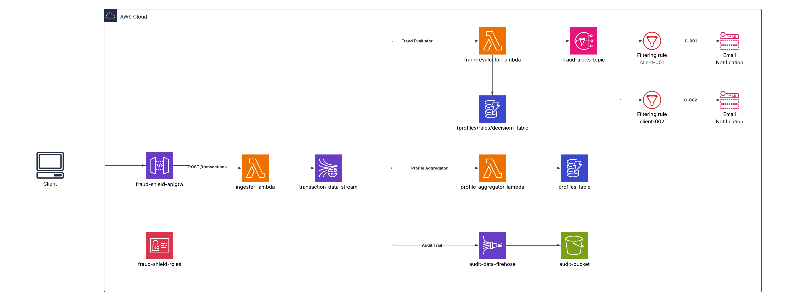

<p align="center">
  <a href="https://gustavopalacios.dev">
    <picture>
      <source media="(prefers-color-scheme: dark)" srcset="https://raw.githubusercontent.com/gpalaciosvx3/gpalaciosvx3/master/assets/brand/logo-dark.svg">
      
    </picture>
  </a>
</p>

<p align="center">
  <a href="https://gustavopalacios.dev"></a>
  <a href="https://www.npmjs.com/org/gpkit"></a>
  <a href="https://www.linkedin.com/in/gustavopalaciosv"></a>
  <a href="https://github.com/gpalaciosvx3"></a>
</p>

# FraudShield

Motor de detección de fraude en tiempo real para sistemas financieros y de seguros. Evalúa transacciones en menos de 200 ms contra reglas de negocio configurables y perfiles de comportamiento histórico del cliente, emitiendo decisiones **APPROVE / REJECT / REVIEW** con notificación inmediata al equipo de riesgo.

---

## Índice

- [Arquitectura](#arquitectura)
  - [Flujo end-to-end](#flujo-end-to-end)
  - [Recursos AWS](#recursos-aws)
- [API Reference](#api-reference)
  - [Endpoints](#endpoints)
  - [Códigos de error](#códigos-de-error)
- [Instalación y desarrollo local](#instalación-y-desarrollo-local)
- [CI/CD](#cicd)
  - [Pipelines](#pipelines)
  - [Secretos requeridos](#secretos-requeridos)

---

## Arquitectura

> Diagrama: `docs/architecture.png`


### Flujo end-to-end

Tres consumidores independientes procesan el mismo stream de Kinesis sin interferirse:

```
Sistemas origen
        │ HTTPS + API Key
        ▼
API Gateway  →  Lambda tx-ingester  →  Kinesis Data Streams (partición por clientId)
                                              │
                  ┌───────────────────────────┼───────────────────────┐
                  ▼                           ▼                       ▼
     Lambda fraud-evaluator       Lambda profile-aggregator     Kinesis Firehose
      │  DynamoDB fraud-rules       DynamoDB client-profiles      S3 audit trail
      │  DynamoDB client-profiles
      │  DynamoDB fraud-decisions
      └  SNS fraud-alerts → equipo de riesgo (email)
```

### Recursos AWS

| Recurso | Nombre | Descripción |
|---|---|---|
| API Gateway HTTP | `UE1FRAUDSHIELDGTW001` | Entry point con API Key + throttling |
| Lambda tx-ingester | `UE1FRAUDSHIELDLMB001` | Valida payload y publica en Kinesis |
| Lambda fraud-evaluator | `UE1FRAUDSHIELDLMB002` | Evalúa reglas y emite decisión |
| Lambda profile-aggregator | `UE1FRAUDSHIELDLMB003` | Mantiene perfil estadístico por cliente |
| Kinesis Data Streams | `UE1FRAUDSHIELDKDS001` | 2 shards · partición por `clientId` · 7 días |
| DynamoDB fraud-rules | `UE1FRAUDSHIELDDDB001` | Reglas configurables por tipo de transacción |
| DynamoDB client-profiles | `UE1FRAUDSHIELDDDB002` | Perfil estadístico por cliente |
| DynamoDB fraud-decisions | `UE1FRAUDSHIELDDDB003` | Historial + idempotencia por `transactionId` |
| SNS fraud-alerts | `UE1FRAUDSHIELDSNS001` | Alertas por email al equipo de riesgo |
| Kinesis Data Firehose | `UE1FRAUDSHIELDFHS001` | Entrega a S3 (buffer 60 s / 5 MB) |
| S3 audit trail | `ue1fraudshields3001` | Registro inmutable · partición `year/month/day/clientId` |

---

## API Reference

Todas las rutas requieren el header `x-api-key`.

### Endpoints

#### POST `/v1/transactions`

Ingesta una nueva transacción al motor de evaluación.

**Request body:**
```json
{
  "transactionId": "TX-20260521-0001",
  "clientId": "C-001",
  "amount": 5800,
  "region": "US-MIA",
  "type": "PAYMENT",
  "timestamp": "2026-05-21T10:00:00.000Z"
}
```

**Response `200`:**
```json
{
  "data": {
    "transactionId": "TX-20260521-0001",
    "status": "RECEIVED"
  }
}
```

---

### Códigos de error

```json
{ "code": "APP-001", "description": "Ocurrió un error inesperado" }
```

| Código | HTTP | Descripción |
|---|---|---|
| `APP-001` | 500 | Error inesperado |
| `APP-002` | 500 | Variable de entorno faltante |
| `APP-003` | 400 | Body de request inválido |

---

## Instalación y desarrollo local

```bash
# Instalar dependencias
npm install && cd cdk && npm install && cd ..

# Verificación de tipos
npm run build

# Tests unitarios
npm test
```

---

## CI/CD

### Pipelines

| Archivo | Trigger | Acción |
|---|---|---|
| `.github/workflows/deploy.yml` | `pull_request` → `master` | Valida tipos, tests y `cdk synth` |
| `.github/workflows/deploy.yml` | `push` → `master` | Bootstrap + deploy en AWS |

El pipeline de **validación** (PR) garantiza que ningún cambio rompe el build ni los tests antes de fusionarse. El pipeline de **despliegue** (push a `master`) despliega directamente en la cuenta AWS configurada en el environment `deployer`.

### Secretos requeridos

Configurar en GitHub → Settings → Environments → **`deployer`**:

```
AWS_ACCESS_KEY_ID
AWS_SECRET_ACCESS_KEY
CDK_DEFAULT_ACCOUNT
AWS_DEFAULT_REGION
RISK_ALERT_EMAIL_CLIENT_A
RISK_ALERT_EMAIL_CLIENT_B
```
